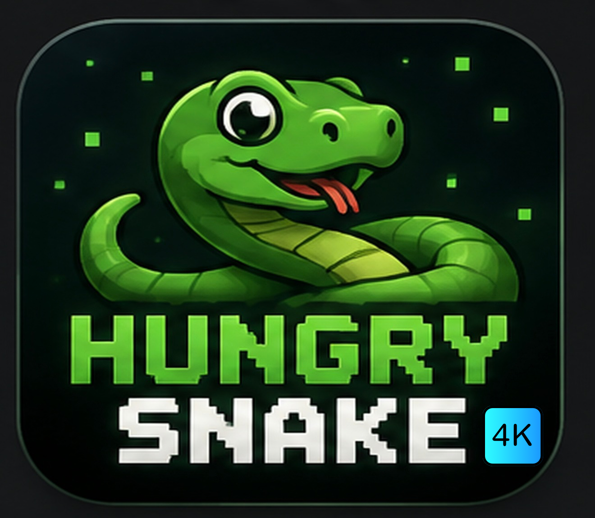
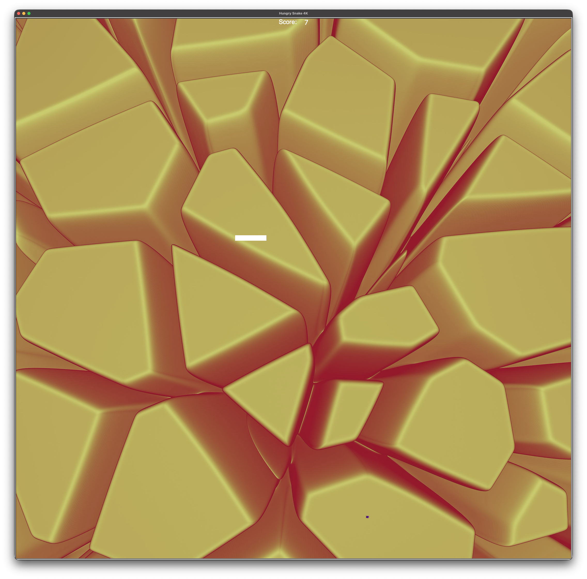

# Hungry Snake 4K - Cross-platform, controller-compatible Snake Game implementation

  

*Hungry Snake 4K* is based heavily on Dr. Angela Yu's implementation of the classic Snake Game using the `turtle` Python library, with some key changes and additions:

- The food the snake eats is all shaped like turtles now
- The color of the food is randomized, based on a list of colors
- If the snake eats a piece of food that is golden, the user gains 10 points. If it eats a piece of food that is silver, the user gains 5 points. For all other kinds of food, the user gains 1 point.
- Controller support is provided via `pygame`. Kindly note that only the left control stick on the Sony DualSense™ Controller has been tested at this time.
- Cross-platform build support is provided via GitHub Actions. macOS and Windows builds have been extensively tested, whereas the Linux build has undergone limited testing. If you would be so gracious as to test this out on your Linux gaming rigs or even feature this game in a YouTube video, it would make me extremely happy. The iOS build has been extensively tested, while of the time of writing this, the Android build is still a WIP.

## Screenshots (macOS)

## AI disclosure
The app icon for *Hungry Snake 4K* is partially AI-generated, with manually added elements via Canva. Also, `controller.py` and `background.py` are entirely AI-generated, created by prompting and troubleshooting via ChatGPT Codex. AI was also used to refactor certain aspects of the code, such as troubleshooting the addition of the resume functionality and soundtrack. The background score was co-produced with ChatGPT Codex, using the Ableton Live MCP and built-in Splice integration. Finally, after much failed experimentation with Python-to-Swift and Python-to-Kotlin translation layers such as the BeeWare suite, the iOS and Android builds were entirely created by DeepSeek, with a little help from Claude.

## Installation
### macOS
Unzip the latest `.app.zip` file from [Releases](https://github.com/KiwiSingh/HungrySnake4K/releases) and move the `.app` bundle to your `/Applications` folder or directory of choice. Double-click to run, go through first-time safety flow, and enjoy!
### Windows
Download the latest `.exe` file from [Releases](https://github.com/KiwiSingh/HungrySnake4K/releases). Copy the `.exe` file to `C:/Program Files`, `C:/Program Files (x86)`, or your directory of choice. Also create a Desktop shortcut, and a Quick Launch icon, for good measure.
### Linux
Unzip the latest zip file from [Releases](https://github.com/KiwiSingh/HungrySnake4K/releases), and then extract the tarball inside. The resulting directory should contain a version file and a Unix executable. Run the executable directly through your terminal emulator of choice.
### iOS
Download the latest `.ipa.zip` file from [Releases](https://github.com/KiwiSingh/HungrySnake4K/releases), unzip it, and install the resulting IPA using a sideloading method of your choice. I strongly recommend using [AltStore](https://altstore.io) or [SideStore](https://sidestore.io) if on a non-jailbroken device. Otherwise, for legacy (jailbroken) devices, use [TrollStore](https://github.com/opa334/TrollStore) instead.
### Android
Download the latest APK (when available) from [Releases](https://github.com/KiwiSingh/HungrySnake4K/releases), copy it to your phone, go through the usual "Unknown sources" scare screen, deal with Play Protect shenanigans, install the APK, and enjoy the game!

## Testing
This game has been tested natively on an M3 MacBook Air with 16 gb of unified memory. The Windows version has been tested inside of CrossOver Preview 26. Finally, the iOS version has been tested on a state-of-the-art iPhone 17 Pro Max. However, there might still be gaps in the UX that might need addressing. See the next section.

## Contact
In case of any issues with the game or the code, open a GitHub Issue, or contact me at [kiwisingh@proton.me](mailto:kiwisingh@proton.me)

## Copyright disclaimers
The background images used in this project are all images created by artist [Steve A Johnson](https://www.pexels.com/@steve/) on Pexels. Nokia 3310 and the original Snake game are both registered trademarks of the Nokia corporation. DualSense™ and PlayStation 5 are both registered trademarks of Sony Computer Entertainment and the Sony corporation at large. M3, the MacBook Air, macOS, iOS, iPhone, Game Mode, Swift, and Apple Color Emoji, are all registered trademarks of Apple. Windows is a registered trademark of Microsoft Corporation. GNU/Linux and the Linux kernel are both registered trademarks of Linus Torvalds. Courier New is a registered trademark of The Monotype Corporation. The original Snake game code (which was the inspiration for this project) is owned by Dr. Angela Yu and The App Brewery, London. Python, Turtle Graphics, and `turtle` are all registered trademarks of the Python Software Foundation. Android, Google Play, Play Protect, and YouTube are all registered trademarks of Google, Inc. and Alphabet Corporation. Kotlin is a registered trademark of JetBrains s.r.o. BeeWare and Toga are registered trademarks of The BeeWare Project. DeepSeek is a registered trademark of Hangzhou DeepSeek Artificial Intelligence Co., Ltd. ChatGPT Codex and ChatGPT Work are registered trademarks of OpenAI and Sam Altman. Claude is a registered trademark of Anthropic, Inc. lunaluxe and The Vamps are both established artists/bands, and the background music used in this project only apes their style, and does not intend to infringe on their copyrights in any way, shape, or form. *Hungry Snake 4K* is my own, open-source creation. The *Hungry Snake 4K* logo is partially AI-generated, but is not free for commercial usage without my prior consent. No rights or lack thereof can be derived from this repository, or these disclaimers.
